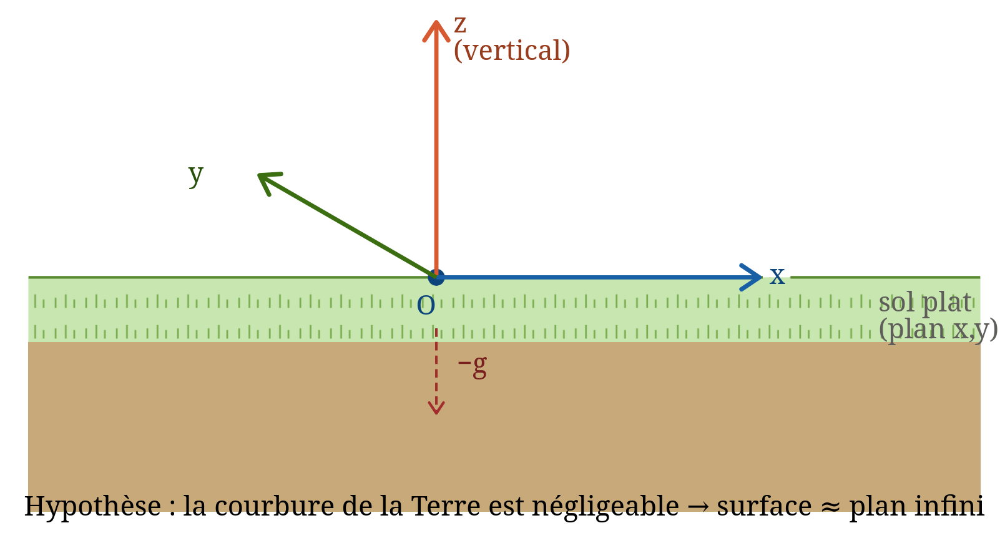
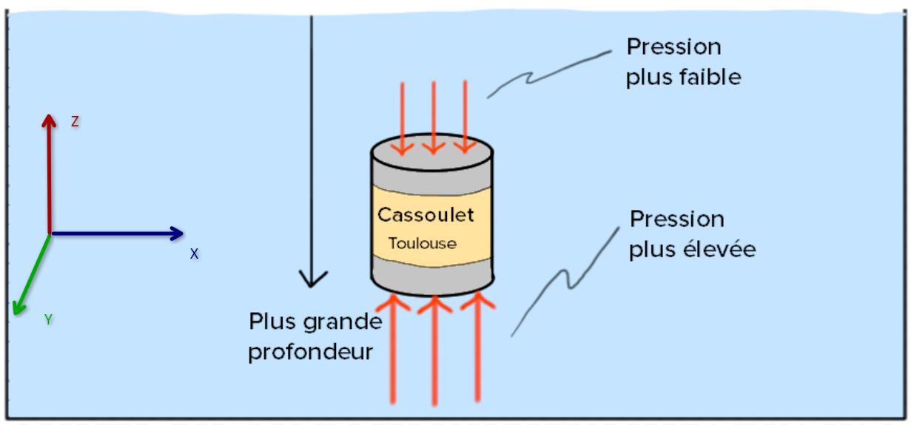

## sous-marin

### fonctionnement

#### principe de la ballast

notre système est placé au sol (champs de pesanteur $g \simeq 9,81 m.s^2$)

système : Masse m

repère : terrestre cartésien

bilan des forces :

* le poid :

$$  \overrightarrow{P}=M_{système}\*g\*(-\overrightarrow{e_z}) $$

* la réaction du support

$$ \overrightarrow{R}=R\*\overrightarrow{e_z} $$

2ème loi Newton :

$$ \Rightarrow M_{système}\overrightarrow{a}=\sum_{i}\overrightarrow{F_i} $$
$$ \Rightarrow \overrightarrow{a}=(R-M_{système}\*g)\*\overrightarrow{e_z} $$

expérimentalement, on verra que le système ne bouge pas donc il est à l'équilibre
	
cependant dans l'eau, il n'y a pas de réaction du support le système devrait couler. Cependant le système "remplace" un volume d'eau et ce volume veux "reprendre" sa place appliquant une pression sur la surface du système qui dépend de la profondeur. Cela créer une différence de pression (voir ci-dessous)

comme la pression est plus forte en bas que en haut alors le système est poussé vers les z positif et cette force est appelé :

* la poussée d'Archimède :

$$ \overrightarrow{P_A} = \rho_{eau}\*V_{déplacé}\*g $$

masse volumique de l'eau $\rho_{eau} = 997 kg.m^3

