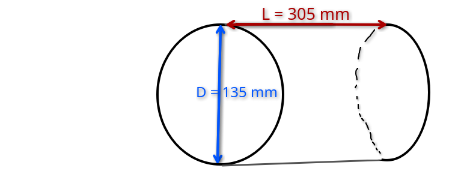

# sous-marin

## fonctionnement

### ballast avec une seringue

notre système est placé au sol (champs de pesanteur $g \simeq 9,81 m.s^2$)

système : Masse m

repère : terrestre cartésien

bilan des forces :

* le poid :

$$  \overrightarrow{P}=M_{système}g(-\overrightarrow{e_z}) $$

* la réaction du support

$$ \overrightarrow{R}=R\overrightarrow{e_z} $$

2ème loi Newton :

$$ \Rightarrow M_{système}\overrightarrow{a}=\sum_{i}\overrightarrow{F_i} $$

$$ \Rightarrow M_{système}\overrightarrow{a}=(R-M_{système}g)\overrightarrow{e_z} $$

expérimentalement, on verra que le système ne bouge pas donc il est à l'équilibre
	
cependant dans l'eau, il n'y a pas de réaction du support le système devrait couler. Cependant le système "remplace" un volume d'eau et ce volume veux "reprendre" sa place appliquant une pression sur la surface du système qui dépend de la profondeur. Cela créer une différence de pression (voir ci-dessous)

comme la pression est plus forte en bas que en haut alors le système est poussé vers les z positif et cette force est appelé :

* la poussée d'Archimède :

$$ \overrightarrow{P_A} = ρ_{eau}V_{déplacé}g\overrightarrow{e_z} $$

masse volumique de l'eau $ρ_{eau} = 997 kg.m^3$

dimension du système :

Volume d'un cylindre $ V = \pi (D/2)^2L $

Volume max de la seringue : $ 60 mL = 6*10^{-5} $

2ème loi Newton :

$$ \Rightarrow M_{système}\overrightarrow{a}=\sum_{i}\overrightarrow{F_i} $$

$$ \Rightarrow M_{système}\overrightarrow{a}=(ρ_{eau}V_{déplacé}-M_{système})g\overrightarrow{e_z} $$

$$ \Rightarrow M_{système}\overrightarrow{a}=(ρ_{eau}(V_{structure}-V_{seringue})-M_{système})g\overrightarrow{e_z} $$

on veut que le système soit à l'équilibre quand $ V_{seringue} = 0 $

$$ (ρ_{eau}V_{structure}-M_{système})g\overrightarrow{e_z}=\overrightarrow{0} $$

$$ \Rightarrow M_{système} = ρ_{eau}V_{structure} $$

AN : $ M_{système} \simeq 4,353 kg $

grâce à des morceaux d'acier attacher on mesure expérimentalement $ M_{système} \simeq 4,335 kg $

comme on est légèrement plus léger, cela signifie que la seringue devra être un peu plus rempli pour commencer à faire couler le système.

ainsi l'équation qui défini notre système est :

$$ \Rightarrow M_{système}\overrightarrow{a}=ρ_{eau}V_{seringue}g\overrightarrow{e_z} $$

### mesure profondeur avec un capteur de pression

sur Terre, la pression se calcule ainsi : $ P = hρg $

avec h la distance entre le capteur et le haut de l'atmosphère

Pour retirer la couche d'atmosphère, on mesure une pression de référence dès l'allumage du sous-marin. Cela nous permet de déterminé la profondeur sous l'eau avec :

$$ ρg(h_{référence}-h) = P_{mesure}-P_{référence} $$

$$ h_{profondeur} = \frac{P_{mesure}-P_{référence}}{ρg} $$

pour améliorer le résultat, on peut ajouté un autre capteur plus bas sur la coque, car ρg ne sont pas réellement constant. En connaissant la différence de hauteur entre les 2 capteurs appelé Δ. On a le système d'équation suivant :

$$ 1 : ρgh_{profondeur1} = P_{mesure1} - P_{référence} $$
$$ 2 : ρgh_{profondeur2} = P_{mesure1} - P_{référence} $$
$$ 2 : h_{profondeur1}-h_{profondeur2} = Δ $$

$$ \Rightarrow h_2 = Δ(\frac{P_{mesure2}-P_{référence}}{P_{mesure1}-P_{mesure2}}\Delta) $$